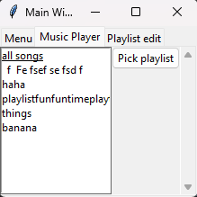
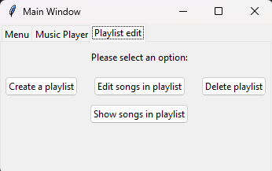
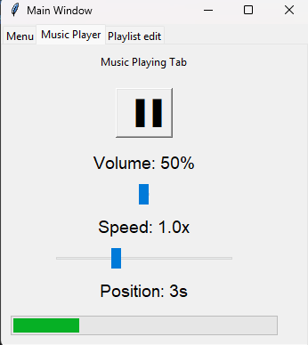

# Final Project

## Project Description  
---
This is our final team project for Computer Science 2! It plays songs.  

## Execution And Usage  
---
You can switch inbetween the tabs to different things. You can create playlists, delete playlists, edit playlists, and show playlists in the playlist edit tab. In the Music Player tab you pick a playlist to use and then it will play the songs in that playlist. You can also change the volume and speed of the song.  
  
Music Player Tab:  
  
  
Playlist Edit Tab:  

  
What it looks like when you play a song:  

## Used Technologies  
---

+ Tkinter  
`No install`  

+ Pandas  
`pip install pandas`  

+ Pydub  
`pip install pydub`  

+ Pygame  
`pip install pygame`  

+ Sounddevice  
`pip install sounddevice`  

+ Scipy  
`pip install scipy` 

## Current Features  
---
+ It plays songs  
+ You can change the volume and speed  
+ Add songs and customize playlists  

## Contributors  
+ Jackson
+ Alec
+ Sawyer
+ Vincent
+ Various testers (family/friends)
+ Copilot - Helping with using/learning libraries and debugging  
+ ChatGPT (same as CoPilot)

## Author's Information  
---
Short paragraph about you(Each member of the group, includes contact for professional)

Jackson:
Computer science student who really likes to code lots of fun stuff! Contact me at jackson.hauley@ucas-edu.net

Alec:
I lost the game. I am a computer science project that likes to figure out how to code random things. I've taken a few python classes, and enjoyed all of them. To contact, email at alec.george@ucas-edu.net  

Sawyer:  
I am a computer science student and I work on python projects.

Vincent:
